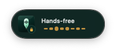
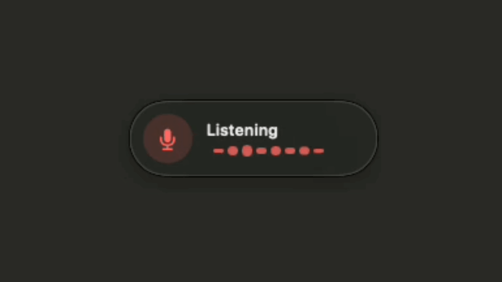
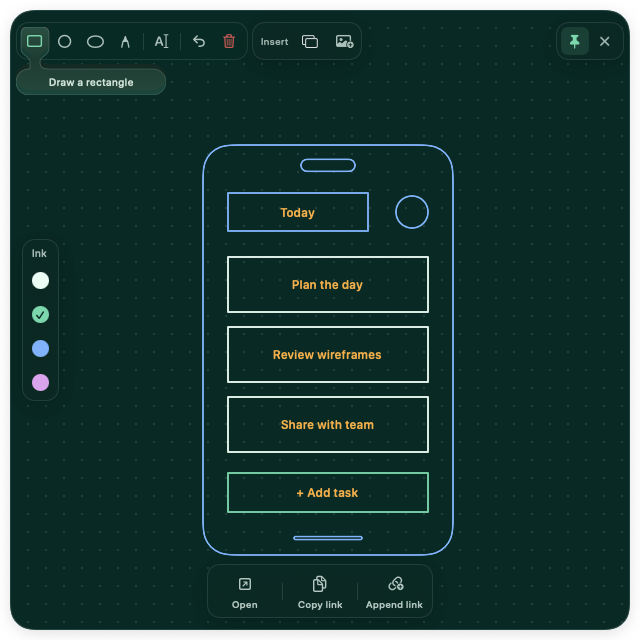

<p align="center">
  
</p>

<h1 align="center">Tiro</h1>

<p align="center">
  
</p>

<p align="center">
  
  
  
  
</p>

<p align="center"><a href="https://github.com/Salazar-Prime/tiro/releases">Download the public beta</a></p>

Tiro turns speech into text at your cursor on macOS. Hold a shortcut, speak, and release to transcribe with OpenAI or locally with whisper.cpp. Capture screenshots and sketch UI ideas from the same menu-bar app.

Tiro requires Microphone and Accessibility access. Screenshot features additionally require Screen Recording access.

## Voice

<p align="center">
  
</p>

| Voice | Wireframe | Paste recent |
| :---: | :---: | :---: |
| <kbd>⌃</kbd> <kbd>⌥</kbd> | <kbd>⌃</kbd> <kbd>⌥</kbd> <kbd>W</kbd> | <kbd>⌃</kbd> <kbd>⌘</kbd> <kbd>V</kbd> |

Hold Control + Option to speak; release to insert. Double-tap for hands-free recording.

<p align="center">
  
</p>

[Watch the video](docs/demos/voice-typing/voice-typing.mp4).

## Wireframe Board

Sketch a phone or browser UI with shapes, labels, and colored ink. Insert your latest screenshot, then save a PNG or copy its local path. [Drawing and export guide](docs/wireframe-board.md).

<p align="center">
  
</p>

## Setup

You need macOS 14 or newer plus Microphone and Accessibility permission. Screenshot capture additionally requires Screen Recording permission. Choose a transcription engine in Settings:

- **OpenAI** uses `gpt-4o-mini-transcribe` and requires an API key with API billing enabled. The key stays in macOS Keychain.
- **On-device** uses [whisper.cpp](https://github.com/ggml-org/whisper.cpp) and a one-time, roughly 60 MB English model download. It does not require an API key.

Public beta builds are code-signed with Tiro’s project-local identity and Sparkle updates are separately signed, but the app is not Apple-notarized or signed with a trusted Developer ID. Gatekeeper therefore does not accept it as a standard identified-developer download. On first launch, macOS may require you to Control-click Tiro and choose **Open**.

When installing from the DMG, drag `Tiro.app` to the Applications shortcut, then launch it from `/Applications`.

## Updates

Tiro uses Sparkle 2 for signed updates. It checks the GitHub-hosted update feed automatically, and you can run a manual check from **Check for Updates…** in the menu-bar menu.

## Build

```sh
git clone https://github.com/Salazar-Prime/tiro.git
cd tiro
./Scripts/build-app.sh
./Scripts/create-dmg.sh
open "dist/Tiro.app"
```

Move `Tiro.app` to `/Applications` before granting permissions so macOS can keep them stable across updates.

## Privacy

- Recording starts only when you use the shortcut.
- In OpenAI mode, Tiro sends the recording and any optional transcription instructions directly to OpenAI's `/v1/audio/transcriptions` endpoint using your API key. The current build uses `gpt-4o-mini-transcribe`, not the `whisper-1` model.
- In On-device mode, audio and transcription stay on your Mac. When you choose **Download** in Settings, Tiro downloads the pinned English `base.en` Q5 model from Hugging Face, verifies its size and SHA-256 hash, and stores it in Application Support. You can remove it from Settings. Tiro uses whisper.cpp 1.9.2; optional vocabulary/context is an initial Whisper prompt, not post-processing.
- OpenAI handles these requests under its API data controls, which differ from ChatGPT's consumer data controls. Its current policy lists the transcription endpoint as not used for training, with no abuse-monitoring or application-state retention. See [OpenAI's API data controls](https://developers.openai.com/api/docs/guides/your-data#default-usage-policies-by-endpoint).
- Temporary audio is written to macOS's temporary directory. Tiro deletes it when you cancel, when a recording is too short, and after transcription succeeds or fails. A crash may leave a file until macOS clears temporary data.
- Tiro does not send analytics, telemetry, crash reports, or application logs. Limited operational diagnostics stay in macOS's local unified log and do not include audio or transcript content.
- Transcript history stays on this Mac and can be searched, deleted, or cleared at any time.
- Screenshots are taken only when you choose a capture action and remain in your local `Pictures/Tiro screenshots` folder.
- Wireframe Board drawings stay in memory while Tiro is running. Exported wireframes remain as PNG files in `Pictures/Tiro screenshots`; Tiro does not upload them.
- **Copy Link** places the exported wireframe’s formatted local path on the clipboard until you replace it. **Append Link** reads the current plain-text clipboard entry and replaces it with the original text followed by that path; it does not read clipboard history. Other temporary pasteboard content used during screenshot insertion is restored and marked to keep it out of compatible clipboard-history apps.
- Sparkle contacts Tiro's GitHub-hosted update feed to check for new releases.

## Feature checklist

- [x] Paste the last transcript again with <kbd>Control</kbd> + <kbd>Command</kbd> + <kbd>V</kbd>
- [x] Browse, search, copy, delete, and clear local transcript history
- [x] Capture the visible screen without the menu bar or Dock, or drag a selection
- [x] Customize voice, wireframe, paste, and screenshot shortcuts from Settings
- [x] Open searchable transcript history inside Settings or with a custom shortcut
- [x] Sketch labeled UI wireframes and export or copy their local PNG paths

## Development

```sh
swift test
swift build
```

Beta releases follow [APP_PUBLISH.md](APP_PUBLISH.md). Tiro uses SwiftUI/AppKit, AVFoundation, Security/Keychain, OpenAI transcription, whisper.cpp, and Sparkle 2.
