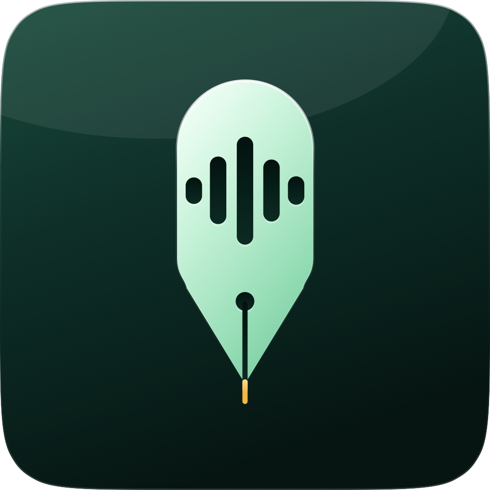

<p align="center">
  
</p>

<h1 align="center">Tiro</h1>

<p align="center">Hold a shortcut, speak, and put the transcript at your cursor.</p>

<p align="center">
  
  
  
  
</p>

<p align="center"><a href="https://github.com/Salazar-Prime/tiro/releases">Download the public beta</a></p>

Tiro is a small native macOS menu-bar app for voice typing. It pauses active media, mutes system output while recording, sends the finished recording to OpenAI, and inserts the transcript into the focused text field.

## Shortcuts

| Gesture | Result |
| --- | --- |
| Hold <kbd>Control</kbd> + <kbd>Option</kbd> | Record; release to transcribe and insert |
| Double-tap <kbd>Control</kbd> + <kbd>Option</kbd> | Lock recording hands-free |
| Press <kbd>Control</kbd> + <kbd>Option</kbd> while locked | Stop and insert |
| <kbd>Control</kbd> + <kbd>Command</kbd> + <kbd>V</kbd> | Insert the last transcript again |

## Setup

You need macOS 14 or newer, an OpenAI API key with API billing enabled, and Microphone and Accessibility permission. The API key stays in macOS Keychain.

Public beta builds are Sparkle-signed but not yet Apple-notarized. On first launch, macOS may require you to Control-click Tiro and choose **Open**.

## Build

```sh
git clone https://github.com/Salazar-Prime/tiro.git
cd tiro
./Scripts/build-app.sh
open "dist/Tiro.app"
```

Move `Tiro.app` to `/Applications` before granting permissions so macOS can keep them stable across updates.

## Privacy

- Recording starts only when you use the shortcut.
- Temporary audio is deleted after transcription.
- Transcript history stays on this Mac and can be cleared at any time.
- Any temporary pasteboard content is restored and marked to keep it out of compatible clipboard-history apps.

## Development

```sh
swift test
swift build
```

Beta releases follow [APP_PUBLISH.md](APP_PUBLISH.md). Tiro uses SwiftUI/AppKit, AVFoundation, Security/Keychain, OpenAI transcription, and Sparkle 2.
