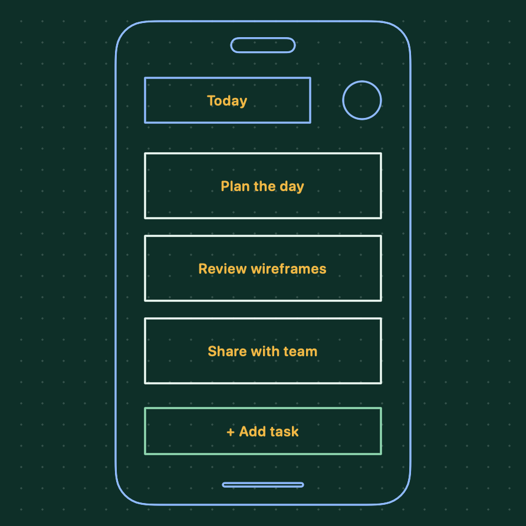

# Wireframe Board

Open **Wireframe Board…** from Tiro's menu, or press **Control + Option + W**. Change the shortcut in **Settings → Shortcuts**.

## Draw

- Click two opposite corners for a rectangle or frame. For a circle, click its center and edge; for an ellipse, click both ends of its major axis, then set its width.
- Drag with **Pen** for freehand marks. Type a label after drawing, or use **Label** to select an existing element's border.
- Choose one of four ink swatches before drawing. To recolor an element, select it with **Label**, then choose a swatch. Labels remain gold; inks adapt to light and dark mode.
- **Insert** offers mobile, browser, and dotted frames. **Insert last screenshot** adds the latest Tiro screenshot behind your drawings, preserving its proportions and leaving room for the tools.
- Undo removes the latest element. **Clear all** empties the board without deleting source screenshots.

## Keep or close

Pin the board to keep it visible when focus changes. **Esc** cancels an unfinished drawing or label edit; otherwise it closes the board. Clicking outside a label saves the edit. The opening and closing animations respect macOS Reduce Motion.

## Export

**Save** creates a tightly cropped square PNG in `Pictures/Tiro screenshots`. It becomes **Open** for that saved version until the artwork, label, or theme changes.

**Copy link** copies the formatted local file path. **Append link** adds it to the current clipboard text. Configure path wrapping in **Settings → Screenshots**; paths use single quotes by default. These are local paths, not uploaded image links.

Drawings stay in memory while Tiro runs. Save a PNG to keep your work after quitting.

## Example

This task-screen wireframe was drawn in Tiro and exported directly:

